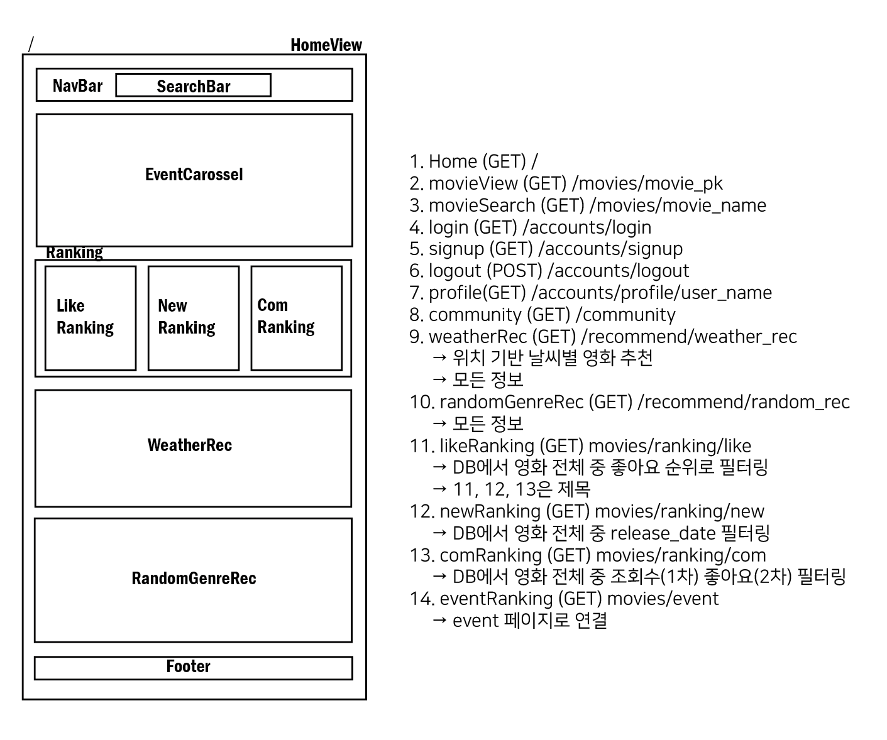
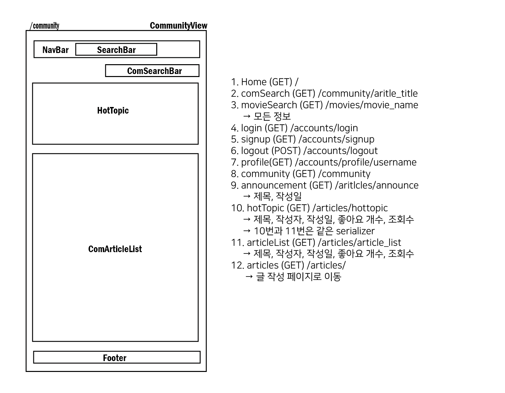
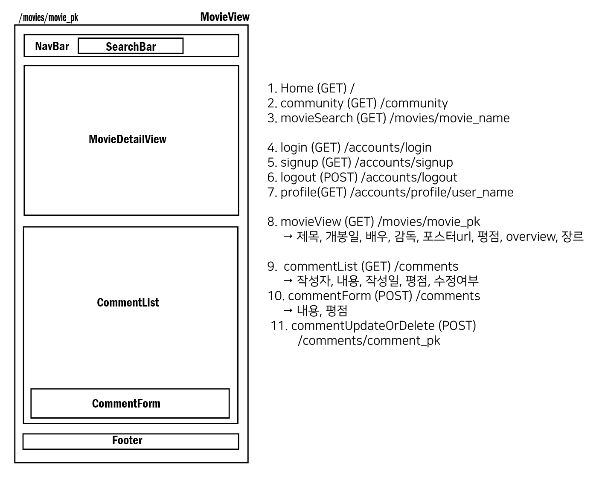
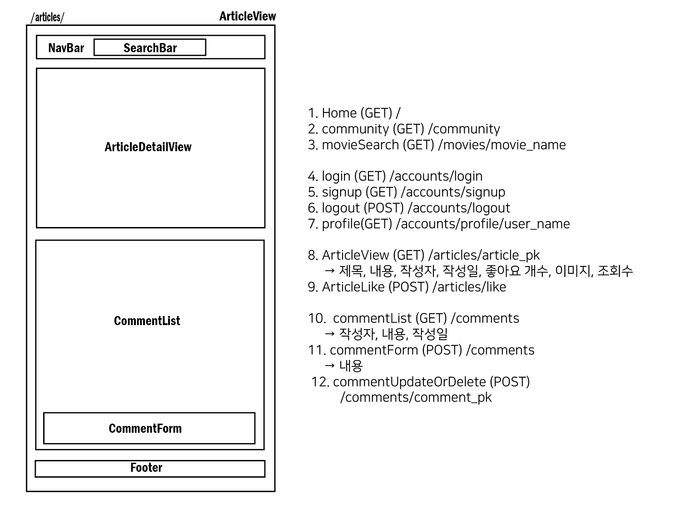
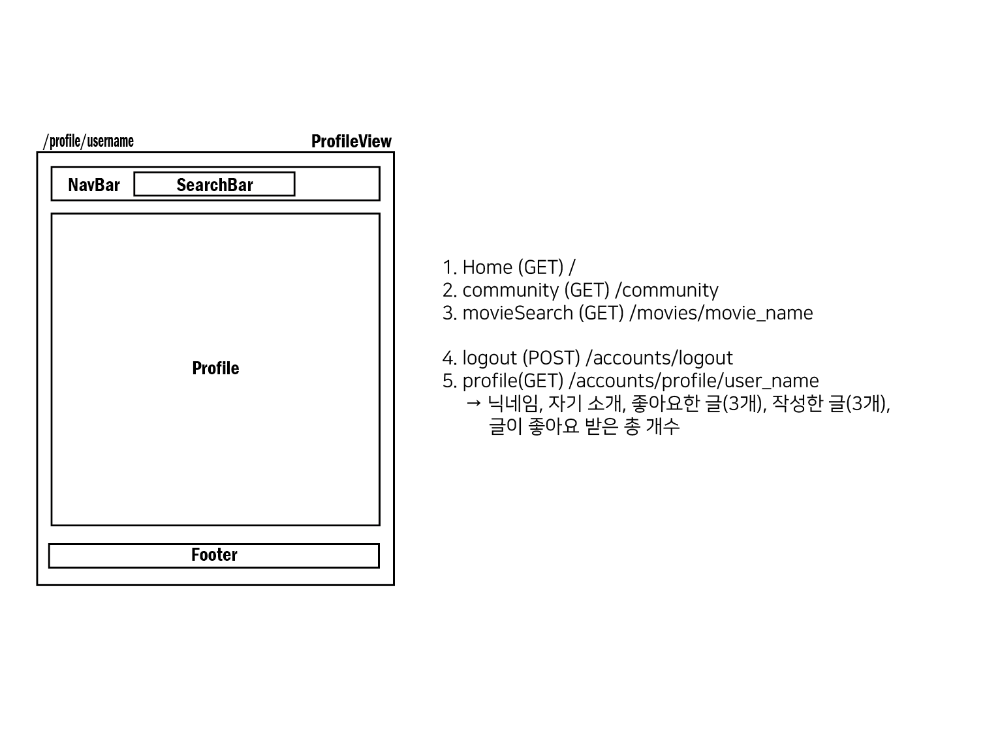
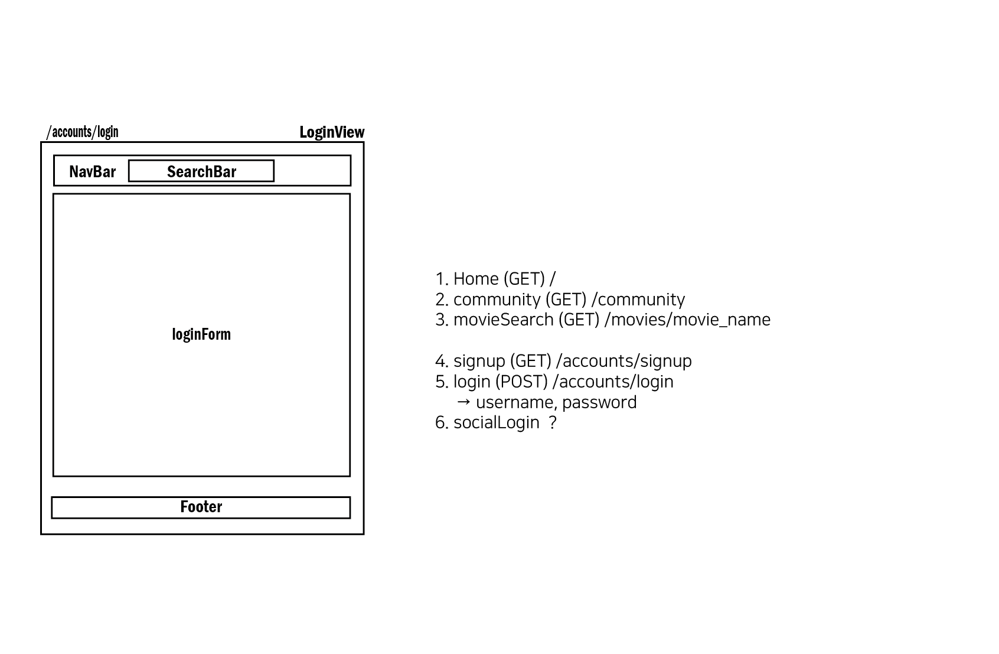
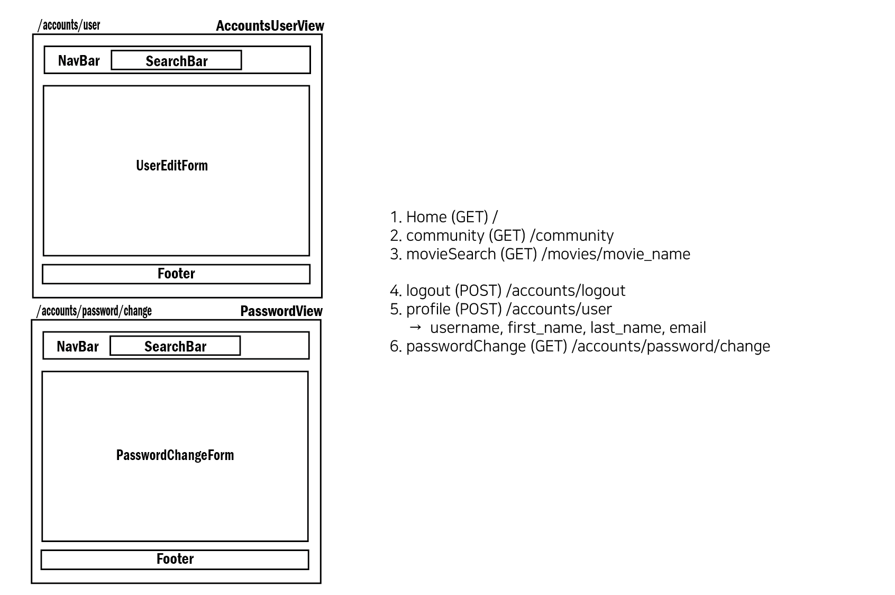
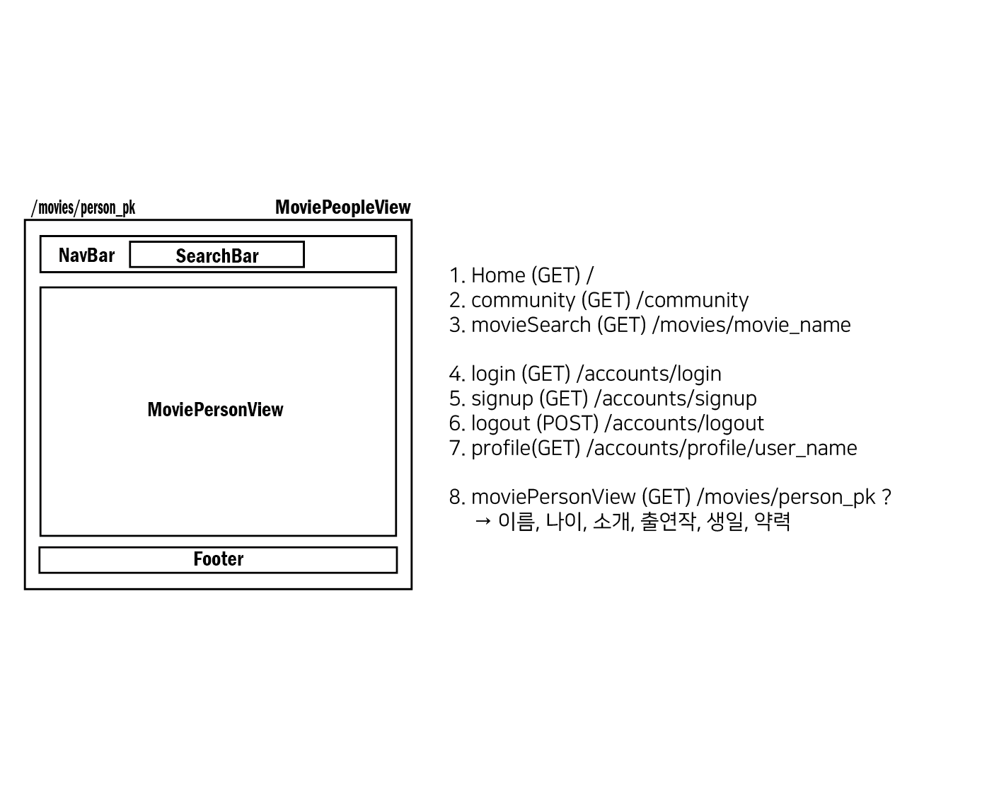

# Movie Website Project

### ✨ 프로젝트 개요

- **프로젝트명** : 
- **팀원** : 문유주, 정혜령
- **시작일** : 2022.05.20. (금)
- **완료일** :
- **기술 스택** : Python, Django, Javascript, Vue, HTML, CSS
- **Notion** : https://utopian-manatee-ff7.notion.site/Movie-Site-Project-8b0d4ffc6118494e8a45aaf5a59e5880

### ✨ 프로젝트 목표 

1. 영화 데이터 기반 추천 웹 사이트 구성
2. 날씨와 장르에 기반한 영화 추천 알고리즘 구성
3. 사이트 내 커뮤니티 서비스 구성

### ✨ 프로젝트 컨셉 & 주요 기능

1. UI/UX

---

### ✨ 프로젝트 일정표 & 진행 상황

| 번호 | 기능/목표                                           | 담당자 | 시작일 | 종료 예정일 | 종료일 |
| ---- | --------------------------------------------------- | ------ | ------ | ----------- | ------ |
| 1    | 프로젝트 컨셉 및 시나리오 구상                      | 공통   | 5/20   | 5/20        | 수정중 |
| 2    | DB 설계                                             | 공통   | 5/20   | 5/20        | 수정중 |
| 3    | URL 설계                                            | 공통   | 5/20   | 5/20        | 수정중 |
| 4    | Software 구조 설계 (vue component)                  | 공통   | 5/20   | 5/20        | 수정중 |
| 5    | Django & Vue 프로젝트 생성 및 기본 연결 설정 + CORS | 공통   | 5/20   | 5/20        | 5/20   |
| 6    | Django 모델 작성                                    | 공통   | 5/20   | 5/20        | 수정중 |
| 7    | Django Admin 관리자 생성 및 등록                    | 혜령   | 5/22   | 5/22        | 5/22   |
| 8    | Django serializer 작성                              | 유주   | 5/20   | 5/25        | 작업중 |
| 9    | Django views.py 작성 (알고리즘 제외)                | 공통   | 5/20   | 5/25        | 작업중 |
| 10   | 추천 알고리즘 개발                                  | 공통   | 5/20   | 5/25        | 작업중 |
| 11   | 개발용 테스트 데이터 생성                           | 유주   | 5/20   | 5/20        | 5/20   |
| 12   | POSTMAN으로 API 테스트                              | 공통   | 5/20   | 5/25        | 작업중 |
| 13   | Django Authentication & Authorization 기능 구현     | 공통   | 5/20   | 5/24        | 5/23   |
| 14   | Vue Home component 생성 (template 위주)             | 혜령   | 5/20   | 5/26        | 작업중 |
| 15   | Vue Community component 생성 (template 위주)        | 공통   | 5/21   | 5/26        | 작업중 |
| 16   | Vue 나머지 Component 생성  (template 위주)          | 공통   | 5/21   | 5/26        | 작업중 |
| 17   | Vue router 작성                                     | 혜령   | 5/20   | 5/20        | 수정중 |
| 18   | Vue Vuex store 작성 및 component와 연결             | 공통   | 5/20   | 5/26        | 작업중 |
|      |                                                     |        |        |             |        |
|      | 메인페이지 랭킹 차트                                | 공통   |        | 5/24        |        |
|      | 메인 페이지 중앙 carousel                           | 공통   |        | 5/26        |        |
|      | 메인 페이지 시간대별 추천                           | 공통   |        | 5/25        |        |
|      | 메인 페이지 위치 기반 날씨별 추천                   | 공통   |        | 5/25        |        |
|      |                                                     |        |        |             |        |
|      |                                                     |        |        |             |        |
|      | 영화 페이지                                         | 공통   | 5/23   | 5/25        | 작업중 |
|      | 영화 댓글 기능                                      | 유주   | 5/23   | 5/25        | 5/23   |
|      | 커뮤니티 핫토픽 기능                                | 혜령   | 5/23   | 5/24        | 작업중 |
|      | 커뮤니티 게시글 댓글 기능                           | 혜령   | 5/23   | 5/23        | 작업중 |
|      | 커뮤니티 게시글 기능                                | 공통   | 5/20   | 5/25        | 작업중 |
|      | 커뮤니티 게시글 좋아요                              | 공통   | 5/20   | 5/20        | 5/23   |
|      | 커뮤니티 게시글 조회수                              | 공통   | 5/22   | 5/23        | 5/23   |
|      | 커뮤니티 게시글 시간                                | 혜령   | 5/21   | 5/21        | 5/21   |
|      | 커뮤니티 게시글 수정 여부                           | 혜령   | 5/21   | 5/21        | 5/23   |
|      | 사이트 html, css 디자인                             | 공통   | 5/20   | 5/26        | 작업중 |
|      | 발표 준비                                           |        |        | 5/26        |        |

---

### ✨ 프로젝트 초기 설계

1. **DB 설계 - ERD**

   

   

2. **URL - API 주소**

   - HOST = `http://127.0.0.1:8000/api/v1/`

   | 번호 | url                                                     | 기능                                               |
   | ---- | ------------------------------------------------------- | -------------------------------------------------- |
   |      | **[accounts]**                                          |                                                    |
   | 1    | admin/                                                  | 관리자 페이지 렌더링                               |
   | 2    | accounts/password/reset/                                |                                                    |
   | 3    | accounts/password/rest/confirm/                         |                                                    |
   | 4    | accounts/login/                                         | 로그인 기능                                        |
   | 5    | accounts/logout/                                        | 로그아웃 기능                                      |
   | 6    | accounts/user/                                          | 개인 정보 조회                                     |
   | 7    | accounts/password/change                                | 비밀번호 변경                                      |
   | 8    | accounts/signup/                                        | 회원가입 기능                                      |
   | 9    | accounts/profile/\<str:username>/                       | 유저 프로필 조회                                   |
   |      | **[movies]**                                            |                                                    |
   | 1    | movies/\<int:movie_pk>/                                 | 개별 영화 조회                                     |
   | 2    | movies/\<int:movie_pk>/reviews/                         | 영화별 댓글 리스트 조회 및 댓글 생성               |
   | 3    | movies/\<int:movie_pk>/reviews/\<int:review_pk>/        | 개별 댓글 수정 및 삭제                             |
   | 4    | movies/\<str:movie_name>/                               | 영화 이름으로 영화 목록에서 영화 조회 (search bar) |
   | 5    | movies/\<int:person_pk>/                                | 영화계 인물 조회                                   |
   | 6    | movies/recommend/weathcer_rec/                          | 위치 정보 기반 날씨별 영화 추천                    |
   | 7    | movies/recommend/random_rec/                            | 페이지 새로고침 할 때마다 장르별 랜덤 영화 추천    |
   | 8    | movies/ranking/like/                                    | 좋아요 높은 순 랭킹 차트 조회                      |
   | 9    | movies/ranking/new/                                     | release_date 순 랭킹 차트 조회                     |
   | 10   | movies/ranking/community/                               | 커뮤니티 클 좋아요 순 랭킹 차트 조회               |
   |      | **[community]**                                         |                                                    |
   | 1    | community/\<int:article_pk>/                            | 개별 게시글 detail 조회                            |
   | 2    | community/\<int:article_pk>/like/                       | 게시글 좋아요 기능                                 |
   | 3    | community/\<int:article_pk>/comments/                   | 게시글 별 댓글 조회 및 생성                        |
   | 4    | community/\<int:article_pk>/comments/\<int:comment_pk>/ | 댓글 수정 및 삭제                                  |
   | 5    | community/\<article_title>/                             | 글 이름으로 글 찾기 (search bar)                   |
   | 6    | community/announce/                                     | 공지 글 조회                                       |
   | 7    | community/hottopic/                                     | 인기 글 조회                                       |
   | 8    | community/articles/                                     | 전체 글 목록 조회 및 글 생성                       |

   

3. **Software 구조**

   

---

### ✨ 프로젝트 구현

