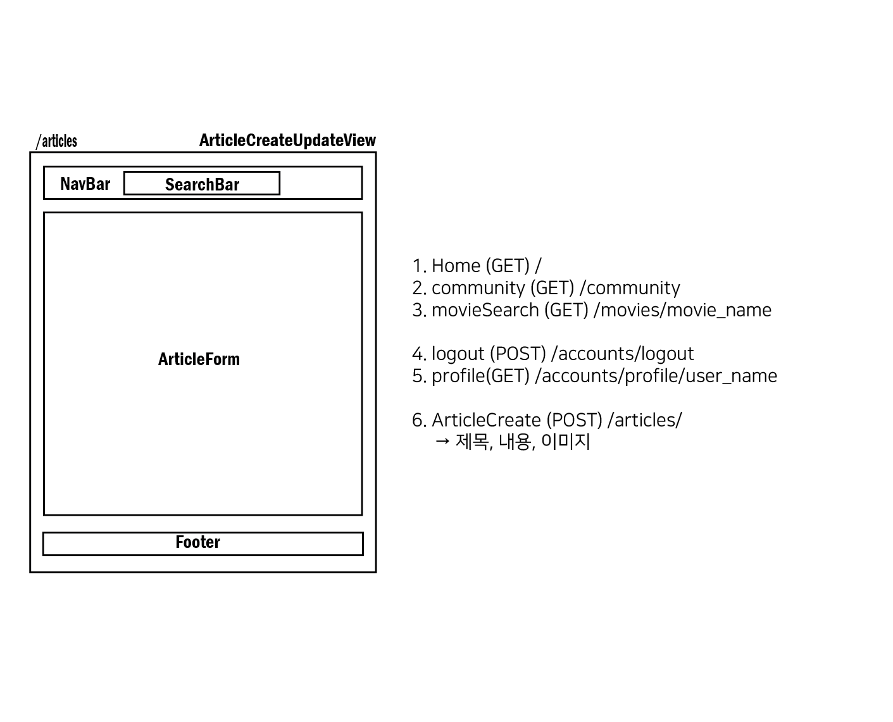
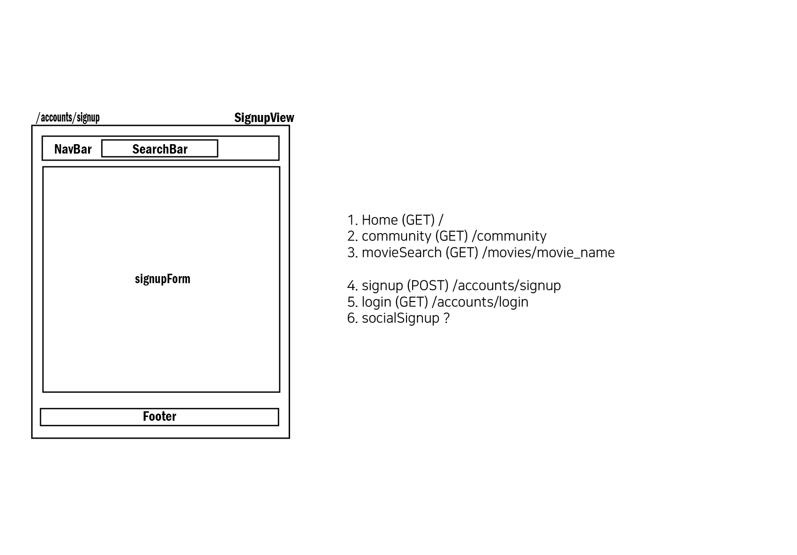

# Movie Website Project

## ✨ 프로젝트 개요

- **프로젝트명** : Ghost
- **팀원**: **광주 2반 문유주, 정혜령**
- **역할 분배**
  - 팀장 : 정혜령
    - ERD와 software component 구조 시각화
    - vue를 이용한 프론트를 주로 담당: router, axios, component 작성
    - django serializer 및 model 일부 작성
    - 웹페이지에 html, css 적용
    - 사이트 핵심 추천 알고리즘 중 하나인 위치와 날씨 기반 영화 추천 제안 및 작성

  - 팀원: 문유주
    - django를 이용한 백엔드를 주로 담당: model 작성 및 serialization 
    - 데이터를 json 파일로 가공
    - vue axios 일부 작성 
    - 사이트 영상 송출
    - 사이트 핵심 추천 알고리즘 중 하나인 시간대와 장르에 기반한 영화 추천 제안 및 작성
    - 발표

- **시작일** : 2022.05.20. (금)
- **완료일** : 2022.05.26. (목)
- **기술 스택** : Python, Django, Javascript, Vue, HTML, CSS
- **Notion** : https://utopian-manatee-ff7.notion.site/Movie-Site-Project-8b0d4ffc6118494e8a45aaf5a59e5880

 

## 1. 프로젝트 목표 

### 1. 초기 프로젝트 목표

1. 영화 데이터 기반 추천 웹 사이트 구성
2. 날씨와 장르에 기반한 영화 추천 알고리즘 구성
3. 사이트 내 커뮤니티 서비스 구성

### 2. 프로젝트 목표 대비 구현 정도

1. TMDB 사이트의 영화 API를 이용하여 웹 사이트를 구성

2. 날씨 기반 추천 알고리즘은 그대로 진행

   장르 기반 추천 알고리즘은 그대로 가되, 약간 노선을 틀어 시간대마다 어울리는 장르별 추천 알고리즘으로 구현

3. 필요한 최소한의 기능은 모두 갖춘 커뮤니티 서비스 구현

 

## 2. 프로젝트 일정표 & 진행 상황

| 번호 | 기능/목표                                           | 담당자 | 시작일 | 종료 예정일 | 종료일 |
| ---- | --------------------------------------------------- | ------ | ------ | ----------- | ------ |
| 1    | 프로젝트 컨셉 및 시나리오 구상                      | 공통   | 5/20   | 5/20        | 5/26   |
| 2    | DB 설계                                             | 공통   | 5/20   | 5/20        | 5/26   |
| 3    | URL 설계                                            | 공통   | 5/20   | 5/20        | 5/26   |
| 4    | Software 구조 설계 (vue component)                  | 공통   | 5/20   | 5/20        | 5/26   |
| 5    | Django & Vue 프로젝트 생성 및 기본 연결 설정 + CORS | 공통   | 5/20   | 5/20        | 5/20   |
| 6    | Django 모델 작성                                    | 유주   | 5/20   | 5/20        | 5/26   |
| 7    | Django Admin 관리자 생성 및 등록                    | 혜령   | 5/22   | 5/22        | 5/22   |
| 8    | Django serializer 작성                              | 유주   | 5/20   | 5/25        | 5/26   |
| 9    | Django views.py 작성 (알고리즘 제외)                | 유주   | 5/20   | 5/25        | 5/24   |
| 10   | 추천 알고리즘 개발                                  | 공통   | 5/20   | 5/25        | 5/25   |
| 11   | 개발용 테스트 데이터 생성                           | 유주   | 5/20   | 5/20        | 5/20   |
| 12   | POSTMAN으로 API 테스트                              | 공통   | 5/20   | 5/25        | 5/25   |
| 13   | Django Authentication & Authorization 기능 구현     | 혜령   | 5/20   | 5/24        | 5/23   |
| 14   | Vue Home component 생성 (template 위주)             | 혜령   | 5/20   | 5/26        | 5/26   |
| 15   | Vue Community component 생성 (template 위주)        | 공통   | 5/21   | 5/26        | 5/26   |
| 16   | Vue 나머지 Component 생성  (template 위주)          | 공통   | 5/21   | 5/26        | 5/26   |
| 17   | Vue router 작성                                     | 혜령   | 5/20   | 5/20        | 5/26   |
| 18   | Vue Vuex store 작성 및 component와 연결             | 공통   | 5/20   | 5/26        | 5/25   |
| 19   | 메인페이지 랭킹 차트                                | 공통   | 5/23   | 5/24        | 5/25   |
| 20   | 메인 페이지 중앙 carousel                           | 혜령   | 5/25   | 5/26        | 5/25   |
| 21   | 메인 페이지 시간대별 추천                           | 유주   | 5/24   | 5/25        | 5/25   |
| 22   | 메인 페이지 위치 기반 날씨별 추천                   | 혜령   | 5/24   | 5/25        | 5/24   |
| 23   | 영화 상세 페이지 유튜브 기능                        | 유주   | 5/23   | 5/25        | 5/25   |
| 24   | 영화 페이지                                         | 공통   | 5/23   | 5/25        | 5/25   |
| 25   | 영화 댓글 기능                                      | 유주   | 5/23   | 5/25        | 5/24   |
| 26   | 커뮤니티 핫토픽 기능                                | 혜령   | 5/23   | 5/24        | 5/24   |
| 27   | 커뮤니티 게시글 댓글 기능                           | 혜령   | 5/23   | 5/23        | 5/24   |
| 28   | 커뮤니티 게시글 기능                                | 공통   | 5/20   | 5/25        | 5/24   |
| 29   | 커뮤니티 게시글 좋아요                              | 공통   | 5/20   | 5/20        | 5/23   |
| 30   | 커뮤니티 게시글 조회수                              | 공통   | 5/22   | 5/23        | 5/23   |
| 31   | 커뮤니티 게시글 시간                                | 혜령   | 5/21   | 5/21        | 5/21   |
| 32   | 커뮤니티 게시글 수정 여부                           | 혜령   | 5/21   | 5/21        | 5/23   |
| 33   | 사이트 html, css 디자인                             | 공통   | 5/20   | 5/26        | 5/26   |
| 34   | 발표 준비                                           | 유주   | 5/26   | 5/26        | 5/26   |

 

## 3. 프로젝트 초기 설계

1. **DB 설계 - ERD**

   

   

2. **URL - API 주소**

   - HOST = `http://127.0.0.1:8000/api/v1/`

   | 번호 | url                                                     | 기능                                               |
   | ---- | ------------------------------------------------------- | -------------------------------------------------- |
   |      | **[accounts]**                                          |                                                    |
   | 1    | admin/                                                  | 관리자 페이지 렌더링                               |
   | 2    | accounts/password/reset/                                |                                                    |
   | 3    | accounts/password/rest/confirm/                         |                                                    |
   | 4    | accounts/login/                                         | 로그인 기능                                        |
   | 5    | accounts/logout/                                        | 로그아웃 기능                                      |
   | 6    | accounts/user/                                          | 개인 정보 조회                                     |
   | 7    | accounts/password/change                                | 비밀번호 변경                                      |
   | 8    | accounts/signup/                                        | 회원가입 기능                                      |
   | 9    | accounts/profile/\<str:username>/                       | 유저 프로필 조회                                   |
   |      | **[movies]**                                            |                                                    |
   | 1    | movies/\<int:movie_pk>/                                 | 개별 영화 조회                                     |
   | 2    | movies/\<int:movie_pk>/reviews/                         | 영화별 댓글 리스트 조회 및 댓글 생성               |
   | 3    | movies/\<int:movie_pk>/reviews/\<int:review_pk>/        | 개별 댓글 수정 및 삭제                             |
   | 4    | movies/\<str:movie_name>/                               | 영화 이름으로 영화 목록에서 영화 조회 (search bar) |
   | 5    | movies/\<int:person_pk>/                                | 영화계 인물 조회                                   |
   | 6    | movies/recommend/weathcer_rec/                          | 위치 정보 기반 날씨별 영화 추천                    |
   | 7    | movies/recommend/random_rec/                            | 페이지 새로고침 할 때마다 장르별 랜덤 영화 추천    |
   | 8    | movies/ranking/like/                                    | 좋아요 높은 순 랭킹 차트 조회                      |
   | 9    | movies/ranking/new/                                     | release_date 순 랭킹 차트 조회                     |
   | 10   | movies/ranking/community/                               | 커뮤니티 클 좋아요 순 랭킹 차트 조회               |
   |      | **[community]**                                         |                                                    |
   | 1    | community/\<int:article_pk>/                            | 개별 게시글 detail 조회                            |
   | 2    | community/\<int:article_pk>/like/                       | 게시글 좋아요 기능                                 |
   | 3    | community/\<int:article_pk>/comments/                   | 게시글 별 댓글 조회 및 생성                        |
   | 4    | community/\<int:article_pk>/comments/\<int:comment_pk>/ | 댓글 수정 및 삭제                                  |
   | 5    | community/\<article_title>/                             | 글 이름으로 글 찾기 (search bar)                   |
   | 6    | community/announce/                                     | 공지 글 조회                                       |
   | 7    | community/hottopic/                                     | 인기 글 조회                                       |
   | 8    | community/articles/                                     | 전체 글 목록 조회 및 글 생성                       |

   

3. **Software 구조**

   

 

## 4. 프로젝트 필수 기능

### 1. 관리자 뷰

- django admin 페이지를 이용해 구현
- 최상위 관리 권한은 관리자 권한의 유저에게만 부여
- 관리자만 admin 페이지에 접근 가능
  - 페이지에서 유저 권한 수정, 유저에 대한 작업 가능
  - 영화 정보 추가, 변경, 수정 가능

### 2. 영화 정보

- 최소 50개 이상의 seed data

  

- 로그인된 유저는 영화에 대한 평점 등록, 수정, 삭제 가능

  - 별점을 이용해 1 ~ 5점까지 평점 등록 가능
  - 유저가 매긴 평점을 바탕으로 영화의 평균 평점 계산
  - 본인이 쓴 글인 경우 리뷰와 평점 수정 및 삭제 가능

  

### 3. 영화 추천 알고리즘

1. 유저의 위치 정보를 통해 얻은 날씨 정보로 영화를 추천하는 알고리즘

   1. JavaScript의 Geolocation 객체를 이용해 유저의 위치 정보 (위도, 경도) 획득

   2. 위도, 경도를 기반으로 Open Weather Map API를 이용해 날씨 정보 획득

   3. 날씨 별로 장르를 세 개씩 지정해 영화를 필터링

   4. 필터링한 영화 3개를 유저에게 추천 문구와 함께 추천

      

   

    

2. 시간대별로 선정한 장르를 통해 영화를 추천하는 알고리즘

   1. 아침, 오후, 저녁 시간대 별로 장르 선정

   2. 선정한 장르 별로 영화 추천

      

      

    

   3. 랭킹 차트
      1. 유저들이 매긴 평점을 기반으로 1 ~ 5위 추천
      2. 최근에 나온 영화를 최신 날짜 순으로 1 ~ 5위 추천
      3. 유저 커뮤니티 글을 좋아요, 조회수, 댓글 수 순으로 정렬해 1~5위 추천
         1. 조회수는 유저 ip와 아이디를 조합해 만든 키를 기반으로, 커뮤니티 글 상세 보기 페이지에 접근할 때마다 유저 정보 수집

   

   4. 사용자가 추천된 영화를 쉽게 조회하도록 네비게이션 바에 search 기능 추가함으로써 편의성 증대

      

   5. 추천된 영화에 대한 흥미를 느낄 수 있도록, 영화 포스터를 클릭하면 연관 동영상이 뜨도록 설정

      1. 유튜브 API를 이용해 작업
      2. 익숙한 방식으로 영상을 끌 수 있도록, 화면 바깥을 누르면 영화 보는 창에서 나오도록 구현

      

 

4. 커뮤니티

   1. 작성자 본인만 글 및 댓글 수정 삭제 가능

      

   2. 생성 및 수정 시각 표현

      1. 게시글과 댓글 내에는 생성 날짜를 기본적으로 표현
      2. 수정한 경우에만 수정 날짜가 부가적으로 표시
      3. 게시글 외부에서는 얼마 전에 작성된 글인지 출력
         1. 게시글의 생성 시각을 현재 시각에서 빼는 것을 setInterval을 이용해 매 초마다 계산 및 출력

   3. 글을 쉽게 조회 가능하도록 게시글 search와 pagination 기능 추가

      

      

 

5. 기타

   1. 유저가 잘못된 접근을 하는 경우 404 페이지 출력

      

   2. 회원 가입, 로그인, 비밀번호 변경에서 사용자가 유효하지 않은 정보를 입력하면, 에러 메시지로 안내

      1. 사용자의 불편함을 미연에 방지하도록 특히 비밀번호는 작성 중 보이고 끄게 할 수 있도록 설정

         

 

## 5. 느낀 점

- 정혜령
  - 사이트를 직접 처음부터 짜보는 재미가 있었습니다. 특히 팀원과 함께하니 문제가 생겨도 같이 의논할 수 있어 좋았습니다. 또한, 혼자서는 어떻게 해야할지 오래 고민했어야만 할 일도 서로의 아이디어를 보태니 빠르게 답을 내리고 당장 필요한 일에 집중할 수 있었습니다.
  - Model이나 serializer, 기능은 한 번에 구상되로 되면 좋겠지만, 프로젝트 거의 막바지까지 수정이 필요한 영역이었습니다. 처음에 몇몇 영화나 웹툰 같이 미디어 컨텐츠를 다루는 사이트를 미리 사전조사하며 틀을 짜놓고 시작하지 않았더라면, 더 많은 수정이 있었을 것입니다. 그리고 처음에 사이트 전체를 component 단위로 구상하며, 미리 짜 놓았던 것이 큰 도움이 되었습니다. 앞으로도 미리 틀을 짜놓고 들어가면 좋을 것 같습니다. 
  - 생각보다 django에서 vue로 옮길 때 많은 수정이 일어났습니다. 특히 아직 컴포넌트에 미숙해 예상한 API url보다 적게 쓰는 파트도 있는 반면, 더 필요한 부분도 있었습니다. 지금은 각자 주로 프론트나 백을 맡아서 해도, 직접 필요하면 django나 vue에 가서 수정도 하고 새로 만들기도 했는데, 실제 현업에서는 각자 맡은 영역이 완전히 정해져 있기 때문에 의사 소통이 더더욱 중요하겠다는 생각이 들었습니다.
- 문유주
